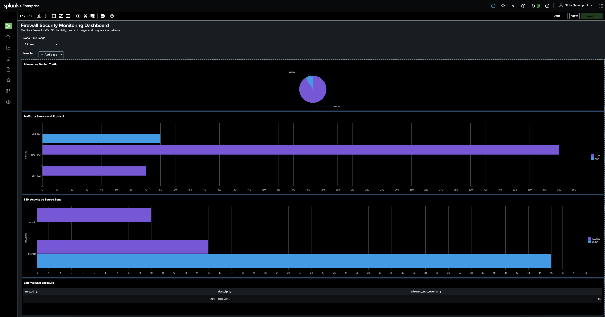
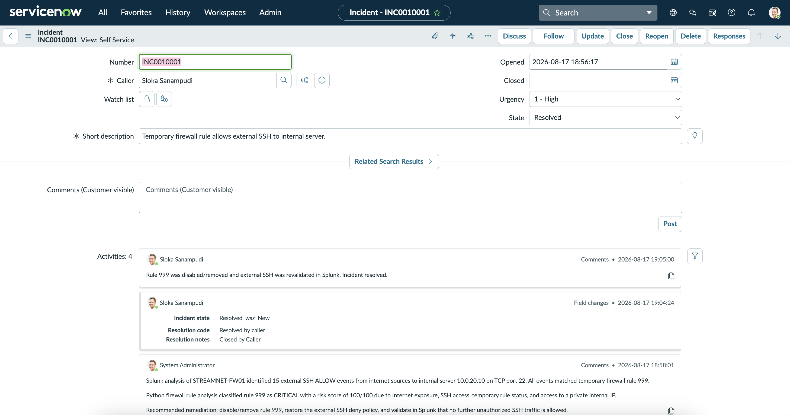

# Enterprise Firewall Security Lab

A cybersecurity portfolio project simulating the detection, investigation, risk analysis, and remediation of a misconfigured enterprise firewall rule.

## Scenario

A temporary firewall rule on `STREAMNET-FW01` accidentally allowed external SSH traffic to an internal server (`10.0.20.10`).

The project demonstrates an end-to-end security workflow using Splunk, Python, ServiceNow, and Git/GitHub.

## Tools

- Splunk Enterprise
- Python
- ServiceNow
- Git/GitHub
- Firewall and network security concepts

## Investigation

500 synthetic firewall events were generated containing:

- Normal HTTPS and DNS traffic
- Legitimate administrator SSH traffic
- Blocked external SSH attempts
- Unauthorized external SSH traffic permitted by temporary rule `999`

Splunk analysis identified **15 external SSH connections** that were allowed to reach:

`10.0.20.10:22`

All 15 connections matched firewall rule `999`.



## Python Risk Analysis

A Python firewall configuration analyzer was created to evaluate firewall rules based on:

- Internet exposure
- SSH exposure
- Private network access
- Temporary rule status

Rule `999` received a:

**CRITICAL risk rating — 100/100**

while legitimate and blocking rules remained low risk.

## Incident Response

The finding was documented in ServiceNow as incident `INC0010001`.

Recommended remediation included:

- Disable/remove firewall rule `999`
- Restore the external SSH deny policy
- Validate that unauthorized SSH traffic is no longer permitted



## Project Workflow

Firewall Logs  
↓  
Splunk Detection & Investigation  
↓  
Rule 999 Identified  
↓  
Python Risk Analysis  
↓  
Critical Risk Finding  
↓  
ServiceNow Incident  
↓  
Remediation & Resolution

## Key Result

Identified a simulated firewall misconfiguration that allowed **15 unauthorized external SSH connections** to an internal server and developed a repeatable workflow for detection, risk assessment, incident documentation, and remediation.

## Repository Structure

```text
enterprise-firewall-security-lab/
├── data/
│   ├── firewall_logs.csv
│   └── firewall_rules.csv
├── python/
│   ├── generate_logs.py
│   └── analyze_firewall_rules.py
├── reports/
│   └── firewall_rule_risk_report.csv
├── screenshots/
├── splunk/
│   └── investigation_queries.spl
└── README.md
